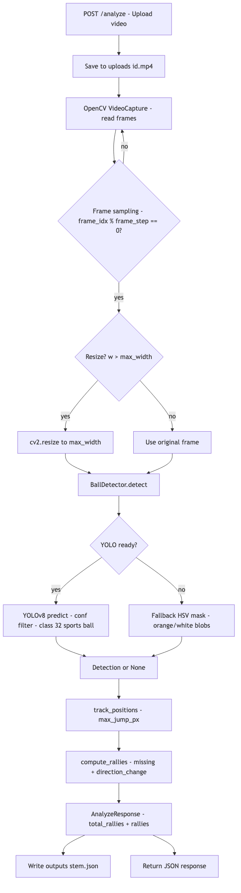

# Pipeline Flow (POC)

Dokumen ini menjelaskan alur pemrosesan dari video sampai keluar statistik sederhana.

## Ringkasan singkat

`video` → (OpenCV decode) → `frames` (di-sampling + resize) → `ball detection` (YOLOv8 / fallback) → `tracking` → `event detection` → `stats` → JSON response + `outputs/<video_stem>.json`

## Flowchart



Sumber diagram (untuk regenerate): `docs/pipeline-flow.mmd`.

```bash
npx -y @mermaid-js/mermaid-cli -i docs/pipeline-flow.mmd -o docs/images/pipeline-flow.png -b white -w 1400
```

## Detail per tahap (mengacu ke kode)

### 1) API: upload → simpan file

- Endpoint: `POST /analyze`
- Input: multipart form field `file`
- Output: JSON (schema `AnalyzeResponse`)

Implementasi ada di `app/routes/analyze.py`:
- video disimpan ke folder `uploads/`
- lalu memanggil `analyze_video(video_path, outputs_dir)`

### 2) Video → frames (decode + sampling + resize)

Implementasi utama ada di `app/services/video_service.py`.

Yang dilakukan:
- Open video via `cv2.VideoCapture`
- Baca `fps_native`
- Tentukan sampling:
  - `target_fps = 10`
  - `frame_step = round(fps_native / target_fps)` (minimal 1)
  - `fps_effective = fps_native / frame_step`
- Loop `cap.read()`:
  - **skip** frame bila `frame_idx % frame_step != 0`
  - **resize** bila lebar frame lebih besar dari `max_width` (default 640)

Tujuan sampling+resize:
- mengurangi jumlah frame yang diproses YOLO (lebih cepat di CPU)
- menurunkan beban inference dengan resolusi lebih kecil

### 3) Ball detection (YOLO → fallback)

Implementasi ada di `app/cv/detection.py` (`BallDetector`).

#### a) YOLO path (utama)

- Model default: `yolov8n.pt`
- `yolo_conf` default: `0.25`
- Filter class:
  - Jika output punya `cls`, maka **diprioritaskan** class id **32** (COCO: “sports ball”)
  - Ini penting untuk mengurangi false-positive dari model COCO umum

Output detector:
- `Detection(x, y, conf)` = titik pusat bbox terbaik
- atau `None` bila tidak ada deteksi yang lolos filter

#### b) Fallback path (aman/cepat, akurasi tergantung kondisi)

Jika YOLO tidak tersedia / gagal:
- Blur → HSV
- mask putih (low saturation, high value) + mask orange
- cari contour kecil (area range) dan ambil centroid

### 4) Tracking (single-object, nearest-by-distance)

Implementasi ada di `app/cv/tracking.py` (`track_positions`).

Aturan POC:
- simpan `last` (posisi terakhir)
- bila `det` berikutnya jaraknya <= `max_jump_px` → terima
- bila terlalu jauh → anggap lost / false-positive → `None`

Output:
- list sepanjang jumlah “effective frames” (setelah sampling)
- elemen berisi `TrackPoint` atau `None`

### 5) Event detection → rallies + hits

Implementasi ada di `app/cv/events.py` (`compute_rallies`).

#### Rally segmentation

- **Start rally**: frame pertama yang punya `TrackPoint` (non-None)
- **End rally**: bola hilang (`None`) selama `missing_end_frames` berturut-turut
- Hanya simpan rally bila panjangnya ≥ `min_frames_per_rally`

Catatan: semua threshold ini bekerja pada **timeline FPS efektif** (setelah sampling).

#### Hit detection (rule sederhana)

Saat dalam rally:
- hit dihitung jika ada perubahan arah besar
- dihitung dari perubahan vektor kecepatan antar frame:
  - hit jika `1 - dot(prev_dir, dir) >= direction_change_threshold`

Interpretasi kasar:
- makin kecil threshold → makin “sensitif” (lebih banyak hit)
- makin besar threshold → makin “ketat” (lebih sedikit hit)

### 6) Stats + output JSON

Di `app/services/video_service.py`:
- hasil rally dipetakan ke response:
  - `total_rallies`
  - `rallies[]: { hits, duration }`
- `duration` dalam **detik** (\((end-start+1)/fps_effective\))
- juga ditulis file debug `outputs/<video_stem>.json` yang berisi:
  - `fps_native`, `fps_effective`, `frame_step`, `resize_max_width`
  - `debug.num_frames`, `debug.num_detections`, `debug.num_tracked`
  - `track` (list titik / null per frame)

### 7) Video overlay (review visual)

Setelah statistik dan JSON ditulis, pipeline dapat menghasilkan **video MP4 ber-overlay** (bola, rally, hit) untuk memudahkan inspeksi manual.

- Penjelasan lengkap: `docs/overlay-video.md`
- File output: `outputs/overlays/<video_stem>.mp4`
- Web: halaman `/results/{id}` memutar overlay lewat `GET /overlays/{id}` bila file ada

## Parameter yang paling sering di-tuning

Kalau hasil sudah “konsisten tapi belum akurat”, yang biasanya dituning di `app/config.py`:

- `target_fps` (semakin besar → lebih akurat tapi lebih lambat)
- `max_width` (semakin besar → lebih akurat tapi lebih lambat)
- `yolo_conf` (lebih tinggi → kurang false positive tapi bisa miss ball)
- `max_jump_px` (lebih tinggi → track lebih “nyambung” tapi rawan loncat ke false positive)
- `missing_end_frames` (lebih tinggi → rally lebih panjang / tidak cepat putus)
- `direction_change_threshold` (lebih rendah → hit count naik)

